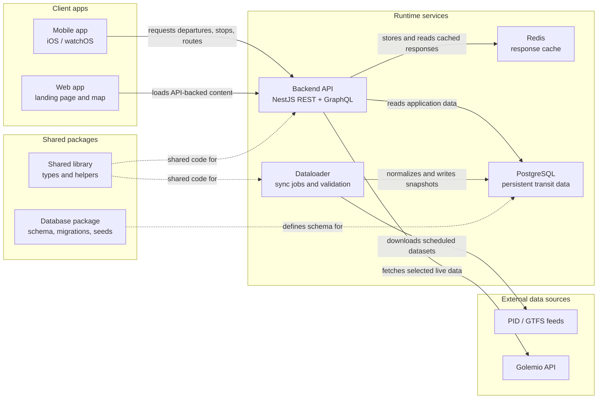

<a href="https://apps.apple.com/cz/app/metro-now/id6504659402?platform=appleWatch">
  
</a>
<a href="https://play.google.com/store/apps/details?id=dev.metronow.android&hl=en">
  
</a>

<br/>

# Metro now

<div align="center">
  <a href="https://api.metronow.dev">
    <b>REST API</b>
  </a>
  •
  <a href="https://api.metronow.dev/graphql">
    <b>GraphQL</b>
  </a>
  •
  <a href="https://status.uptime-monitor.io/6712f0b0063af5950476d77c">
    <b>Status</b>
  </a>
</div>


Transit monorepo with a NestJS backend, Next.js web app, background dataloader, and native iOS/watchOS app. Uses pnpm workspaces and Turborepo.

## Architecture



## Workspace layout

```text
apps/
  backend/      NestJS API (REST + GraphQL)
  database/     schema, migrations, seeds
  dataloader/   background sync worker
  mobile/       iOS / watchOS app (Xcode)
  web/          Next.js website
lib/
  shared/       shared TypeScript package
```

## Requirements

- Node.js 20
- pnpm 10 (via Corepack)
- Docker (PostgreSQL + Redis)
- Xcode (mobile app only)

## Getting started

```bash
corepack enable
pnpm install --frozen-lockfile
cp apps/backend/.env.local.example apps/backend/.env.local
# edit apps/backend/.env.local with your local values
```

## Development

```bash
pnpm docker:up:dev   # start PostgreSQL and Redis
pnpm dev             # run all dev servers
pnpm xcode           # open mobile app in Xcode
```

Run a single app:

```bash
pnpm turbo run dev --filter=@metro-now/backend
pnpm turbo run dev --filter=@metro-now/web
pnpm turbo run dev --filter=@metro-now/dataloader
```

## Common commands

```bash
pnpm build           # build all packages
pnpm test:unit       # run unit tests
pnpm lint            # lint all packages
pnpm types:check     # type-check all packages
pnpm typegen         # generate GraphQL types
pnpm app:format      # format Swift code
```

Scope any Turbo task with `--filter`:

```bash
pnpm turbo run test:e2e --filter=@metro-now/backend
pnpm turbo run migrate:deploy --filter=@metro-now/database
pnpm turbo run seed --filter=@metro-now/database
```

## Docker

```bash
pnpm docker:up       # start full stack (builds containers)
pnpm docker:down     # stop and remove volumes
```

Default ports:

| Service        | Address                  |
| -------------- | ------------------------ |
| Web            | http://localhost:3000    |
| Backend        | http://localhost:3001    |
| PostgreSQL     | localhost:5532           |
| Redis          | localhost:6479           |
| Redis Stack UI | http://localhost:8101    |

## License

[Mozilla Public License 2.0](LICENSE.md)
