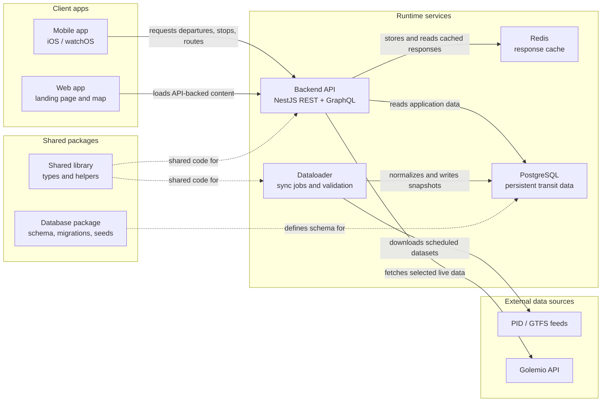

<a href="https://apps.apple.com/cz/app/metro-now/id6504659402?platform=appleWatch">
  
</a>
<a href="https://play.google.com/store/apps/details?id=dev.metronow.android&hl=en">
  
</a>

<br/>

# Metro now

<div align="center">
  <a href="https://api.metronow.dev">
    <b>REST API</b>
  </a>
  •
  <a href="https://api.metronow.dev/graphql">
    <b>GraphQL</b>
  </a>
  •
  <a href="https://status.uptime-monitor.io/6712f0b0063af5950476d77c">
    <b>Status</b>
  </a>
</div>


Metro Now is a transit monorepo built around a NestJS backend, a Next.js web app, a background dataloader, and shared database packages. The repository uses `pnpm` workspaces and Turborepo for task orchestration, caching, and dependency-aware builds.

## Architecture



## Workspace layout

```text
apps/
  backend/      NestJS API
  database/     database package, migrations, seeds
  dataloader/   background sync worker
  mobile/       iOS / watchOS app
  web/          Next.js website
lib/
  shared/       shared TypeScript package
```

## Requirements

- Node.js 20
- `pnpm` 9.1.0 via Corepack
- Docker Desktop for local PostgreSQL, Redis, and container builds
- Xcode for the mobile app

## Getting started

Install dependencies once at the repository root:

```bash
corepack enable
pnpm install --frozen-lockfile
```

Create the backend local environment file:

```bash
cp apps/backend/.env.local.example apps/backend/.env.local
```

Then update `apps/backend/.env.local` with your local values. For containerized runs, the repo also includes `.env.docker` and `.env.web.docker`.

## Development

Start local infrastructure only:

```bash
pnpm docker:up:dev
```

Run the main JavaScript development tasks through Turborepo:

```bash
pnpm dev
```

Useful scoped commands:

```bash
pnpm turbo run dev --filter=@metro-now/backend
pnpm turbo run start:debug --filter=@metro-now/backend
pnpm turbo run dev --filter=@metro-now/web
pnpm turbo run dev --filter=@metro-now/dataloader
```

Open the Apple app in Xcode:

```bash
pnpm xcode
```

## Common commands

All commands are run from the repository root.

```bash
pnpm build
pnpm test
pnpm lint
pnpm types:check
pnpm format:check
pnpm format
pnpm app:format
```

`pnpm format` and `pnpm format:check` run Biome for `apps/backend`, `apps/dataloader`, and `lib/shared`. `pnpm app:format` is the separate Swift formatting entry point for the mobile app.

Scoped commands:

```bash
pnpm turbo run build --filter=@metro-now/backend
pnpm turbo run test --filter=@metro-now/backend
pnpm turbo run test:e2e --filter=@metro-now/backend
pnpm turbo run lint --filter=@metro-now/backend
pnpm turbo run types:check --filter=@metro-now/backend
pnpm turbo run typegen --filter=@metro-now/backend

pnpm turbo run build --filter=@metro-now/web
pnpm turbo run lint --filter=@metro-now/web
pnpm turbo run types:check --filter=@metro-now/web

pnpm turbo run migrate:deploy --filter=@metro-now/database
pnpm turbo run migrate:rollback --filter=@metro-now/database
pnpm turbo run seed --filter=@metro-now/database
```

## Docker

Start the full stack with container builds:

```bash
pnpm docker:up
```

Stop containers and remove volumes:

```bash
pnpm docker:down
```

The default compose setup exposes:

- Web: `http://localhost:3000`
- Backend: `http://localhost:3001`
- PostgreSQL: `localhost:5532`
- Redis: `localhost:6479`
- Redis Stack UI: `http://localhost:8101`

## Turborepo

Turborepo is the task runner for this repository. Root scripts such as `pnpm build`, `pnpm dev`, and `pnpm test` resolve package dependencies automatically instead of relying on manual `cd`-based workflows.

Package-specific task configuration lives in:

- `turbo.json`
- `apps/backend/turbo.json`
- `apps/web/turbo.json`

## CI

GitHub Actions uses the same root commands exposed locally:

- backend CI runs the backend Turbo tasks
- web CI runs the web Turbo tasks
- format CI runs Biome from the root
- Docker CI builds the production images from the root `Dockerfile`

## Notes

- The mobile app is part of the monorepo, but it is developed through Xcode rather than a Turbo `build` or `dev` task.
- Backend GraphQL types are generated through `pnpm turbo run typegen --filter=@metro-now/backend` and are also wired into the Turbo task graph for backend builds and e2e tests.
